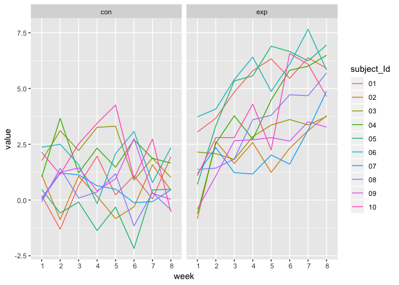
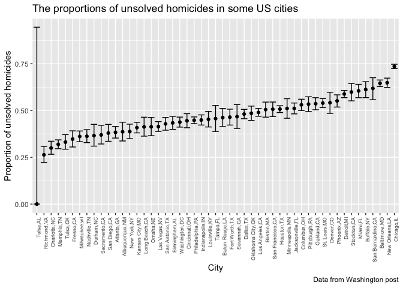

hw5\_xw2598
================
Xinyao Wu
2018/11/4

#### library

Problem 1
---------

``` r
#a dataframe containing all file names
file_ls =tibble(
  path = list.files("data/")
  )
#function:read data
read_data = function(x){
  path = str_c("data/",x)
  file = read.csv(path)
  file
}
#combine data
file = file_ls %>% 
mutate(map(file_ls$path,read_data)) %>% 
  unnest() %>% 
  #separate path name 
  separate(path,into = c("group","subject_Id"), sep = "_") %>% 
  #tidy path name
  mutate(
    subject_Id = str_replace(subject_Id,".csv", " "),
    group = as.factor(group)
      ) %>% 
  #tidy data
 gather(key = "week", value = value, week_1:week_8) %>% 
  mutate(
    week = as.factor(str_replace(week,"week_", " "))
  ) 
```

``` r
file %>% 
ggplot(aes(x = week, y = value, group= subject_Id,color = subject_Id))+
  geom_line()+
  facet_grid(~group)
```

 \#Comments:

Problem2
--------

\*read and clean data

``` r
wp_df = read.csv("https://raw.githubusercontent.com/washingtonpost/data-homicides/master/homicide-data.csv") %>% 
janitor::clean_names() %>% 
  mutate(city_state = str_c(city,state,sep = ","))
```

#### Describe the raw data.

``` r
#calculated the total number of homicides and unsolved homicides
homicide = wp_df %>% 
  group_by(city_state) %>% 
  mutate(
    unsolved = ifelse(disposition == "Closed by arrest",0,1)
      ) %>% 
  summarise(
    total_homicides = n(),
    unsolved_homicides = sum(unsolved)
  ) 
homicide
```

    ## # A tibble: 51 x 3
    ##    city_state     total_homicides unsolved_homicides
    ##    <chr>                    <int>              <dbl>
    ##  1 Albuquerque,NM             378                146
    ##  2 Atlanta,GA                 973                373
    ##  3 Baltimore,MD              2827               1825
    ##  4 Baton Rouge,LA             424                196
    ##  5 Birmingham,AL              800                347
    ##  6 Boston,MA                  614                310
    ##  7 Buffalo,NY                 521                319
    ##  8 Charlotte,NC               687                206
    ##  9 Chicago,IL                5535               4073
    ## 10 Cincinnati,OH              694                309
    ## # ... with 41 more rows

#### comments

``` r
 balti = homicide  %>% 
#select the city of Baltimore,MD
  filter(city_state == "Baltimore,MD") 
#using prop.test function 
balti = prop.test(balti$unsolved_homicides, balti$total_homicides) 
#turn the outcome into a tidy tribble
balti = broom::tidy(balti)  
#pull the estimated proportion and
pull(balti,estimate)
## [1] 0.6455607
#confidence intervals
#low limit
pull(balti,conf.low)
## [1] 0.6275625
#high limit
pull(balti,conf.high)
## [1] 0.6631599
```

``` r
prop_df = homicide %>% 
  mutate(
    test = map2(.x = unsolved_homicides, .y = total_homicides, prop.test),
    test = map(test,broom::tidy)
         )  %>% 
  unnest() %>% 
  select(city_state, estimate, conf.low, conf.high) 
head(prop_df)
```

    ## # A tibble: 6 x 4
    ##   city_state     estimate conf.low conf.high
    ##   <chr>             <dbl>    <dbl>     <dbl>
    ## 1 Albuquerque,NM    0.386    0.337     0.438
    ## 2 Atlanta,GA        0.383    0.353     0.415
    ## 3 Baltimore,MD      0.646    0.628     0.663
    ## 4 Baton Rouge,LA    0.462    0.414     0.511
    ## 5 Birmingham,AL     0.434    0.399     0.469
    ## 6 Boston,MA         0.505    0.465     0.545

### comments

``` r
prop_df %>% 
  ggplot(aes(x = reorder(city_state,estimate), y =estimate))+
  geom_point()+
  geom_errorbar(aes(ymin = conf.low, ymax = conf.high))+
  theme(
    axis.text.x = element_text(angle = 90,hjust = 1,size = 6.5)
  )+
  labs(
    title = "The proportions of unsolved homicides in each city",
    y = "Proportion of unsolved homicides",
    x = "City"
  )
```



#### Comments
