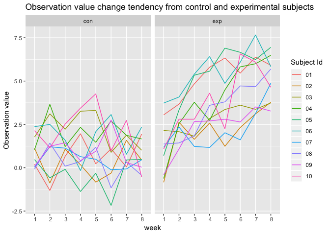
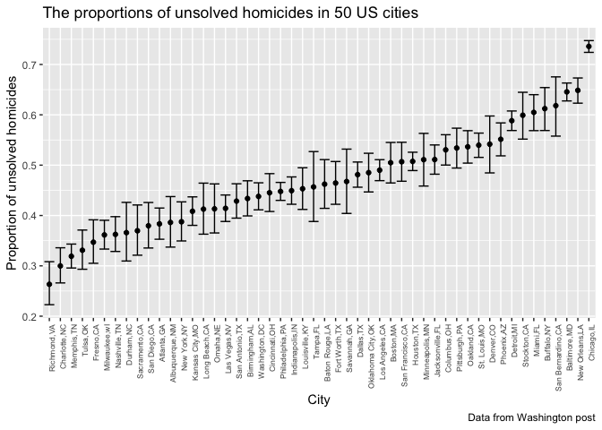

hw5\_xw2598
================
Xinyao Wu
2018/11/4

Problem 1
---------

\*tidy data

``` r
#a dataframe containing all file names
file_ls =tibble(
  path = list.files("data/")
  )
#function:read data
read_data = function(x){
  path = str_c("data/",x)
  file = read.csv(path)
  file
}
#combine data
file = file_ls %>% 
mutate(map(file_ls$path,read_data)) %>% 
  unnest() %>% 
  #separate path name 
  separate(path,into = c("group","subject_Id"), sep = "_") %>% 
  #tidy path name
  mutate(
    subject_Id = str_replace(subject_Id,".csv", " "),
    group = as.factor(group)
      ) %>% 
  #tidy data
 gather(key = "week", value = value, week_1:week_8) %>% 
  mutate(
    week = as.factor(str_replace(week,"week_", " "))
  ) 

file 
```

    ## # A tibble: 160 x 4
    ##    group subject_Id week  value
    ##    <fct> <chr>      <fct> <dbl>
    ##  1 con   "01 "      " 1"   0.2 
    ##  2 con   "02 "      " 1"   1.13
    ##  3 con   "03 "      " 1"   1.77
    ##  4 con   "04 "      " 1"   1.04
    ##  5 con   "05 "      " 1"   0.47
    ##  6 con   "06 "      " 1"   2.37
    ##  7 con   "07 "      " 1"   0.03
    ##  8 con   "08 "      " 1"  -0.08
    ##  9 con   "09 "      " 1"   0.08
    ## 10 con   "10 "      " 1"   2.14
    ## # ... with 150 more rows

This dataset contains 4 variables: group, subject id, week and value. (1)group:control group or experimental group.(2)subject id: indicate different subjects.(3)week: indicate time, ranging from 1 to 8 (4)value: the observation outcome.

\*make a plot

``` r
file %>% 
ggplot(aes(x = week, y = value, group= subject_Id,color = subject_Id))+
  geom_line()+
  facet_grid(~group)+
 
  labs(
    y = "Observation value",
    color = "Subject Id",
    title = "Observation value change tendency from control and experimental subjects "
  )
```



#### Comments:

The observation value change from control group are more static than the experimental group, the latter has an obvious increasing tendency over time. In the control group, the range of obervation value is stable in \[-2,4\].However, in the experimental group, the range of obervation value changed over time which was \[-1.25,3.75\] in the 1st week and then changed to \[2.5,7.5\] in the 8th week.

Problem2
--------

\*read and clean data

``` r
wp_df = read.csv("https://raw.githubusercontent.com/washingtonpost/data-homicides/master/homicide-data.csv") %>% 
janitor::clean_names() %>% 
  mutate(city_state = str_c(city,state,sep = ","))

#date range 
pull(wp_df,reported_date) %>%
  as.character() %>% 
  range()
## [1] "20070101" "20171231"
#victim age range
pull(wp_df,victim_age) %>%as.character() %>% as.integer() %>% range(na.rm =TRUE)
## [1]   0 102
```

#### Describe the raw data:

This data contains 52179 homicides records included information such as reported date ranged from 20070101 to 20171231 and victim age ranged from 0 to 102 years old, and victim\`s name,race,sex and the location details and disposition state of these homicides.

``` r
#calculated the total number of homicides and unsolved homicides
homicide = wp_df %>% 
  group_by(city_state) %>% 
  mutate(
    unsolved = ifelse(disposition == "Closed by arrest",0,1)
      ) %>% 
  summarise(
    total_homicides = n(),
    unsolved_homicides = sum(unsolved)
  ) %>% 
  arrange(desc(total_homicides))
homicide %>% 
  knitr::kable()
```

| city\_state       |  total\_homicides|  unsolved\_homicides|
|:------------------|-----------------:|--------------------:|
| Chicago,IL        |              5535|                 4073|
| Philadelphia,PA   |              3037|                 1360|
| Houston,TX        |              2942|                 1493|
| Baltimore,MD      |              2827|                 1825|
| Detroit,MI        |              2519|                 1482|
| Los Angeles,CA    |              2257|                 1106|
| St. Louis,MO      |              1677|                  905|
| Dallas,TX         |              1567|                  754|
| Memphis,TN        |              1514|                  483|
| New Orleans,LA    |              1434|                  930|
| Las Vegas,NV      |              1381|                  572|
| Washington,DC     |              1345|                  589|
| Indianapolis,IN   |              1322|                  594|
| Kansas City,MO    |              1190|                  486|
| Jacksonville,FL   |              1168|                  597|
| Milwaukee,wI      |              1115|                  403|
| Columbus,OH       |              1084|                  575|
| Atlanta,GA        |               973|                  373|
| Oakland,CA        |               947|                  508|
| Phoenix,AZ        |               914|                  504|
| San Antonio,TX    |               833|                  357|
| Birmingham,AL     |               800|                  347|
| Nashville,TN      |               767|                  278|
| Miami,FL          |               744|                  450|
| Cincinnati,OH     |               694|                  309|
| Charlotte,NC      |               687|                  206|
| Oklahoma City,OK  |               672|                  326|
| San Francisco,CA  |               663|                  336|
| Pittsburgh,PA     |               631|                  337|
| New York,NY       |               627|                  243|
| Boston,MA         |               614|                  310|
| Tulsa,OK          |               583|                  193|
| Louisville,KY     |               576|                  261|
| Fort Worth,TX     |               549|                  255|
| Buffalo,NY        |               521|                  319|
| Fresno,CA         |               487|                  169|
| San Diego,CA      |               461|                  175|
| Stockton,CA       |               444|                  266|
| Richmond,VA       |               429|                  113|
| Baton Rouge,LA    |               424|                  196|
| Omaha,NE          |               409|                  169|
| Albuquerque,NM    |               378|                  146|
| Long Beach,CA     |               378|                  156|
| Sacramento,CA     |               376|                  139|
| Minneapolis,MN    |               366|                  187|
| Denver,CO         |               312|                  169|
| Durham,NC         |               276|                  101|
| San Bernardino,CA |               275|                  170|
| Savannah,GA       |               246|                  115|
| Tampa,FL          |               208|                   95|
| Tulsa,AL          |                 1|                    0|

#### Comments:

The top 3 total homicides cities are : Chicago, Philadelphia, Houston, Baltimore, Detroit.

``` r
 balti = homicide  %>% 
#select the city of Baltimore,MD
  filter(city_state == "Baltimore,MD") 
#using prop.test function 
balti = prop.test(balti$unsolved_homicides, balti$total_homicides) 
#turn the outcome into a tidy tribble
balti = broom::tidy(balti)  
#pull the estimated proportion and
pull(balti,estimate)
## [1] 0.6455607
#confidence intervals
#low limit
pull(balti,conf.low)
## [1] 0.6275625
#high limit
pull(balti,conf.high)
## [1] 0.6631599
```

#### Comments:

The estimated proportion of homicides in Baltimore is 0.6455607 and its confidence interval is \[ 0.6275625, 0.6631599\]

``` r
prop_df = homicide %>% 
  mutate(
    test = map2(.x = unsolved_homicides, .y = total_homicides, prop.test),
    test = map(test,broom::tidy)
         )  %>% 
  unnest() %>% 
  select(city_state, estimate, conf.low, conf.high) 
prop_df %>% arrange(desc(estimate))
```

    ## # A tibble: 51 x 4
    ##    city_state        estimate conf.low conf.high
    ##    <chr>                <dbl>    <dbl>     <dbl>
    ##  1 Chicago,IL           0.736    0.724     0.747
    ##  2 New Orleans,LA       0.649    0.623     0.673
    ##  3 Baltimore,MD         0.646    0.628     0.663
    ##  4 San Bernardino,CA    0.618    0.558     0.675
    ##  5 Buffalo,NY           0.612    0.569     0.654
    ##  6 Miami,FL             0.605    0.569     0.640
    ##  7 Stockton,CA          0.599    0.552     0.645
    ##  8 Detroit,MI           0.588    0.569     0.608
    ##  9 Phoenix,AZ           0.551    0.518     0.584
    ## 10 Denver,CO            0.542    0.485     0.598
    ## # ... with 41 more rows

### comments

The top 5 cities with the most unsolved homicides proportion are:Chicago, New Orleans,Baltimore, San Bernardino, Buffalo. The homicides proportion estimates range 0, 0.7358627

``` r
prop_df %>% 
  ggplot(aes(x = reorder(city_state,estimate), y =estimate))+
  geom_point()+
  geom_errorbar(aes(ymin = conf.low, ymax = conf.high))+
  theme(
    axis.text.x = element_text(angle = 90,hjust = 1,size = 6.5)
  )+
  labs(
    title = "The proportions of unsolved homicides in some US cities",
    y = "Proportion of unsolved homicides",
    x = "City",
    caption = "Data from Washington post"
  )
```



#### Comments

The homicides estimate proportion in Tulsa(AL) is an outlier compared to other cities. This unusual outcome is because Tulsa(Al) only had one record in homicide dataset, which caused the sample size too small to calculate a estimate value. Except this, other cities\` estimate proportions and CIs seems to make sense and those who has wider confidence interbals would have more sample size compared to those who has narrower CI.
